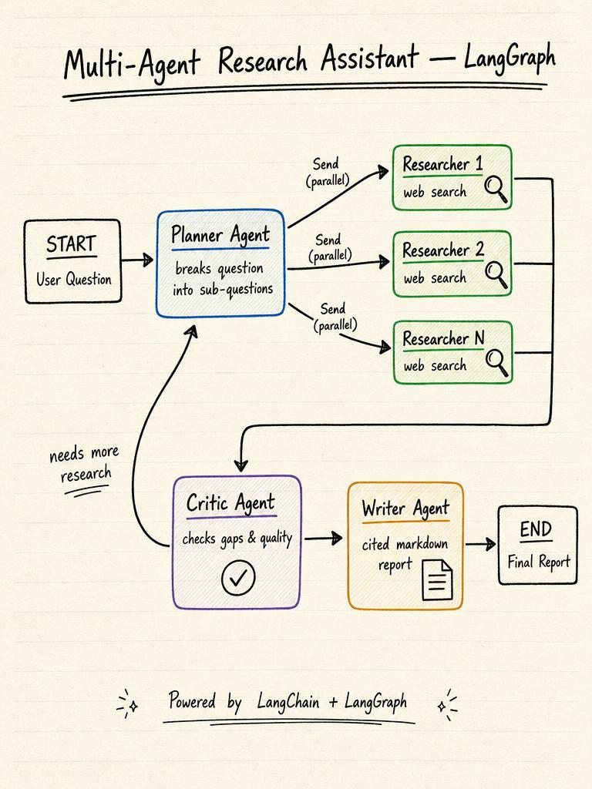

# Multi-Agent Research Assistant

A portfolio-ready research assistant that orchestrates specialized agents with **LangChain** and **LangGraph**.

## Architecture



| Agent | Role |
|-------|------|
| **Planner** | Breaks the main question into focused sub-questions |
| **Researchers** | Search the web and summarize evidence per subtask (parallel) |
| **Critic** | Evaluates coverage and identifies gaps |
| **Writer** | Synthesizes a cited markdown report |

## Features

- LangGraph `StateGraph` with conditional routing and parallel `Send` nodes
- Tavily web search integration (with mock fallback for demos)
- Structured outputs via Pydantic models
- CLI and Streamlit UI
- Optional LangSmith tracing

## Quick start

### With uv (recommended)

```bash
cd /Users/asep/Projects/FDE/multi-agent-research-assistant
uv sync
cp .env.example .env
# Edit .env and set OPENAI_API_KEY
```

`uv` reads `.python-version` (3.12) and installs from `uv.lock`.

### With pip

```bash
cd /Users/asep/Projects/FDE/multi-agent-research-assistant
python -m venv .venv
source .venv/bin/activate
pip install -e ".[dev]"
cp .env.example .env
# Edit .env and set OPENAI_API_KEY
```

### CLI

```bash
# uv
uv run research-assistant "What are the latest advances in agentic RAG?"

# pip (after activating .venv)
research-assistant "What are the latest advances in agentic RAG?"
```

### Streamlit UI

```bash
# uv
uv run streamlit run app/streamlit_app.py

# pip
streamlit run app/streamlit_app.py
```

### Tests

```bash
uv run pytest
```

## Configuration

| Variable | Required | Description |
|----------|----------|-------------|
| `OPENAI_API_KEY` | Yes | OpenAI API key |
| `OPENAI_MODEL` | No | Default: `gpt-4o-mini` |
| `TAVILY_API_KEY` | No | Enables real web search |
| `LANGCHAIN_TRACING_V2` | No | Enable LangSmith tracing |

## Project structure

```
multi-agent-research-assistant/
├── assets/architecture.jpg         # Architecture diagram
├── app/streamlit_app.py          # Web UI
├── src/research_assistant/
│   ├── agents/                   # Planner, Researcher, Critic, Writer
│   ├── graph/workflow.py         # LangGraph definition
│   ├── tools/search.py           # Tavily + mock search
│   └── cli.py                    # Command-line runner
└── tests/
```

## Portfolio tips

1. Add a screenshot of the Streamlit report to your README (architecture diagram is in `assets/`).
2. Enable LangSmith and link a trace showing parallel researcher nodes.
3. Deploy Streamlit on Streamlit Cloud or containerize with Docker.
4. Extend with human-in-the-loop review using LangGraph interrupts.

## License

MIT
